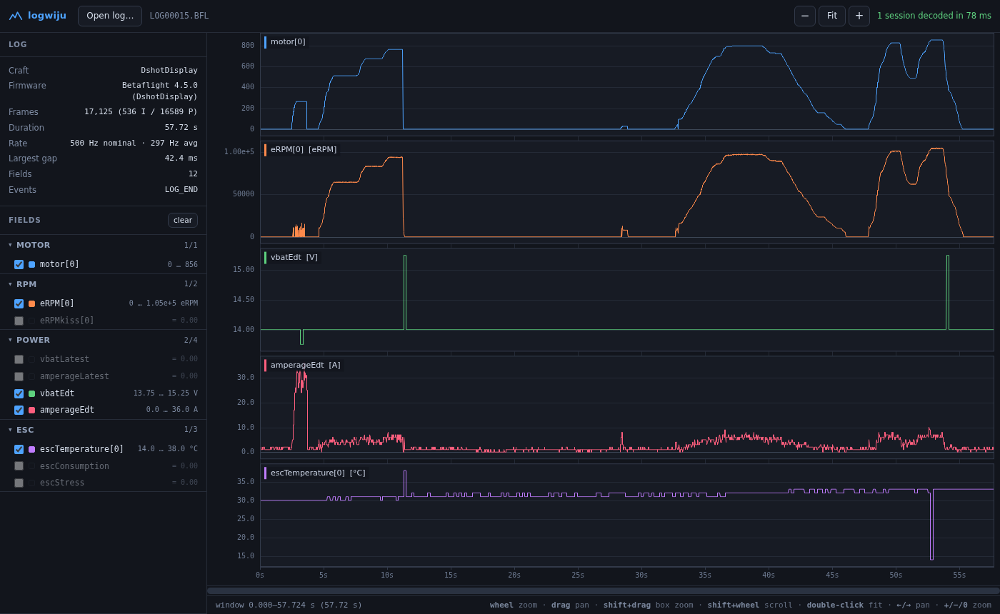

# logwiju

A browser-based viewer for Betaflight blackbox flight logs. Drop in a `.BFL` /
`.BBL` file and it decodes the log and plots every field on a zoomable canvas.

No build step, no dependencies, no upload — the log is parsed entirely in your
browser and never leaves your machine.



## Live version

<https://subtilitas.github.io/logwiju/>

The published site tracks the **latest release**, not the tip of `main`. Pushing
to `main` changes nothing that is live; publishing a release deploys it.

One-time setup: **Settings → Pages → Source: "GitHub Actions"**. The workflow
token can't enable Pages itself — creating a Pages site needs repo admin rights
that `GITHUB_TOKEN` doesn't have — so this switch has to be flipped by hand once.
Until it is, the deploy fails with `Resource not accessible by integration`.

To ship a new version, cut a release (Releases → Draft a new release → pick a
tag → Publish). The workflow in `.github/workflows/pages.yml` then runs the
decoder test and, only if it passes, deploys that tag. Publishing an older
release out of order is ignored, and prereleases are never deployed.

## Running it locally

Browsers refuse to load JavaScript modules from `file://`, so the page has to be
served over HTTP. Any static server works:

```bash
python3 -m http.server 8000
# then open http://localhost:8000
```

Or, if you prefer Node:

```bash
npx http-server -p 8000
```

Opening `index.html` directly will show a message explaining this rather than a
blank page.

## Using it

Click **Open log…** or drag a log file anywhere onto the window.

| Action | Mouse / keyboard | Touch |
| --- | --- | --- |
| Zoom | Wheel (around the pointer) | Pinch (around the midpoint) |
| Pan | Drag, or `←` / `→` | Drag with one or two fingers |
| Zoom to a range | Shift + drag | — |
| Scroll horizontally | Shift + wheel, or the scrollbar | Drag the scrollbar |
| Fit whole log | Double-click, `0`, **Fit** | Double-tap |
| Zoom in / out | `+` / `−` | — |
| Jump to start / end | `Home` / `End` | — |

Pinch keeps the time under the midpoint of your fingers pinned in place, the
same way wheel zoom pins the time under the pointer, so the content never
creeps while you gesture.

Each selected field gets its own lane with an independently auto-scaled Y axis,
so a 100 000 eRPM trace and a 14 V trace stay readable side by side. Moving the
mouse snaps a crosshair to the nearest logged sample and reads out every lane's
value at that instant.

The field list on the left is built from the log itself. Fields are grouped
(Gyro, PID, Motor, RPM, Power, ESC, …) and each one shows its range over the
whole log. Fields that never change are dimmed, since they usually mean a sensor
that was not connected.

### Haptics

On devices with a vibration motor, gestures get short haptic feedback. The
selector in the toolbar sets how much:

| Level | Buzzes on |
| --- | --- |
| Off | nothing |
| Limits only | hitting the end of the log or the zoom limit |
| Gesture edges *(default)* | the above, plus a gesture starting and ending |
| Full | the above, plus a tick as the crosshair snaps to each sample |

Every pattern is a few milliseconds and the whole thing is rate limited, since
scrubbing a chart fires far more events than a motor can usefully respond to.
The control is disabled where `navigator.vibrate` is unavailable — notably iOS
Safari — rather than silently doing nothing. The setting persists across
reloads.

## CSV files

Anything that isn't a blackbox log is treated as CSV, with column names on the
first line. Values may carry their unit inline — `10.23A`, `22,34V`, `-3,5 °C`,
`12 %` — and the unit becomes the lane's axis label. Units written in the header
instead (`voltage (V)`, `speed [km/h]`, `altitude m`) work equally well.

Importing opens a dialog with a live preview, because the settings below can
change what the numbers *mean*, and a silently misread file is much worse than
one that refuses to load:

- **Delimiter** — auto-detected from `;`, `,`, tab or `|` by picking the one
  that splits most consistently
- **Decimal numbers** — auto, German (`1.234,56`) or English (`1,234.56`)
- **What an undecidable `1,234` means** — a thousands group (`1234`) or a
  decimal (`1.234`)
- **Time column and its unit** — s, ms, µs or min, or no time column at all, in
  which case the row number becomes the x axis

Cells that cannot be read under the current settings are struck through in red,
and columns that fail wholesale are called out by name, so choosing the wrong
convention is immediately obvious rather than quietly halving your voltages.

### How German and English numbers are told apart

`1,234` is genuinely ambiguous — German reads 1.234, English reads 1234. Guessing
per value would be unsafe, since the same column could then parse under two
different conventions, which no real exporter produces. So the convention is
decided for the **whole file** from whichever values settle it:

| Value | Reading |
| --- | --- |
| `1.234,56` | both separators — the last one is the decimal → German |
| `1,234.56` | both separators — the last one is the decimal → English |
| `10,23` | one separator, 2 trailing digits — not a thousands group → German |
| `1.5` | one separator, 1 trailing digit — not a thousands group → English |
| `1.234.567` | repeated — that separator groups → German |
| `1,234` | one separator, exactly 3 trailing digits → no evidence |

A single `10,23` anywhere in the file therefore proves comma-decimal, and every
`1,234` in it is read as 1.234. Only when *nothing* in the file settles it does
the fallback apply, and the dialog says so explicitly.

Values are also validated against the chosen convention rather than coerced:
reading the German `1.234,56` as English yields nothing, not `1.23456`.

## What it handles

The decoder is a from-scratch implementation of the Betaflight blackbox format
and follows the reference decoder in
[betaflight/blackbox-log-viewer](https://github.com/betaflight/blackbox-log-viewer):

- All field encodings: signed/unsigned variable byte, `NEG_14BIT`, `TAG8_8SVB`,
  `TAG2_3S32`, `TAG8_4S16` (both the v1 and v2 layouts), `TAG2_3SVARIABLE`
- All field predictors, including straight-line, average-of-2, motor 0,
  min-throttle/min-motor, `vbatref` and GPS home coordinates
- I, P, S, G, H and E frames, with event decoding
- Files containing several concatenated logging sessions — each is decoded
  separately and picked from a dropdown
- Corrupt or truncated files: the decoder resynchronises on the next intra
  frame, reports how many frames were dropped, and shows whatever it recovered

Gyro values are converted to °/s using `gyro.scale` from the header, accelerometer
values to g using `acc_1G`, and — for Betaflight 4.x logs — voltage and current
to V and A. Anything the header doesn't let us convert with confidence is left in
raw units rather than guessed at.

Sample spacing in real logs is not uniform (dropped frames, ESC telemetry
arriving on its own schedule), so the viewer indexes by timestamp rather than by
frame number, and reports both the nominal and average rates along with the
largest gap.

## Performance

Logs routinely contain hundreds of thousands of samples, far more than there are
pixels. Rather than subsampling — which hides exactly the single-frame spikes you
open a blackbox log to find — the renderer computes a min/max envelope per pixel
column and sweeps it, so spikes survive at any zoom level. Once you zoom in far
enough that samples are further apart than a pixel, it switches to a plain
polyline and then to individual sample dots.

The example log (17 125 frames, 12 fields, 215 KB) decodes in around 60 ms.

## Layout

```
index.html               markup, import dialog, boot check
css/style.css            styling
js/bbl-parser.js         blackbox decoder (no DOM deps, runs in Node too)
js/numbers.js            locale-tolerant number + unit parsing
js/csv-parser.js         CSV -> the same log object the renderer takes
js/import-dialog.js      CSV import options with live preview
js/renderer.js           canvas drawing: lanes, axes, envelopes, crosshair
js/interaction.js        wheel/pointer/pinch zoom, pan, scrollbar, keyboard
js/haptics.js            rate-limited vibration feedback
js/app.js                wiring: file loading, field list, readouts
test/verify.mjs          decoder regression test against the example log
test/verify-numbers.mjs  German/English/ambiguous number handling
test/verify-csv.mjs      delimiter, quoting, ragged rows, time scaling
test/fixtures/           small CSVs covering both conventions
exmple_log/              example log used by the tests
```

`js/bbl-parser.js` has no browser dependencies, so it can be used on its own:

```js
import { parseBlackbox } from './js/bbl-parser.js';

const logs = parseBlackbox(new Uint8Array(fs.readFileSync('LOG00015.BFL')));
console.log(logs[0].stats);           // { frames, durationSec, sampleRateHz, ... }
console.log(logs[0].columns['motor[0]']);  // Float64Array
console.log(logs[0].time);            // Float64Array of seconds
```

## Tests

```bash
node test/verify.mjs          # blackbox decoder
node test/verify-numbers.mjs  # German/English/ambiguous numbers, units
node test/verify-csv.mjs      # delimiters, quoting, ragged rows, time scaling
```

`verify.mjs` decodes `exmple_log/LOG00015.BFL` and asserts frame count,
duration, sample rate and per-field min/max against values derived
independently, so a regression in any encoding or predictor shows up
immediately. The other two cover the parts of CSV import that can go wrong
quietly. All three run in CI and block a release if they fail.

## Licence

MIT — see [LICENSE](LICENSE).
